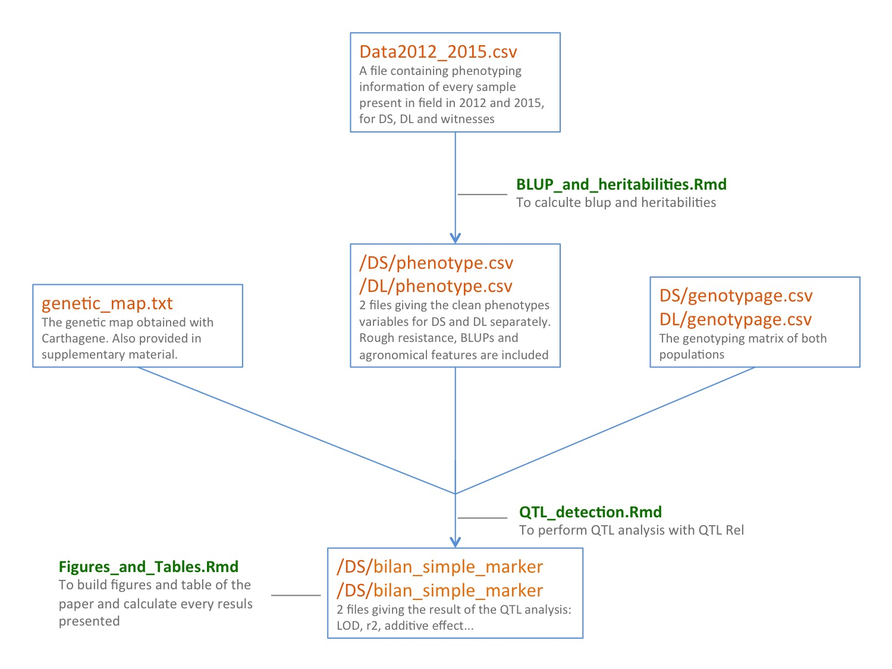

SCRIPT
=======

The analysis followed 5 steps:

#0 - Preparing data
This step allows to go from raw data to a clean dataset ready to work. 2 files were available for 2012 and 2015. This script takes as input these 2 files to build a unique phenotyping dataset merging the 2 years and correcting some notations mistakes.

#1 - Compute Blup
Blups are computed in this part. We also calculated heritbility heres. All of this was realized taking into account the geographical position of individuals among the field.

#2 - QTL Detection
QTL were detected using the QTL-Rel library, to consider relationship between individuals of the population.

#3 - Figures - Tables
This RMD files build most of the key numbers, tables and figures displayed in the publication.

#4 - Epistatic Interaction
Following the request of a reviewer, we computed the interaction effect between every pairs of markers to study potential epistatic effects.

There is a sheme aiming to summarize this process:

